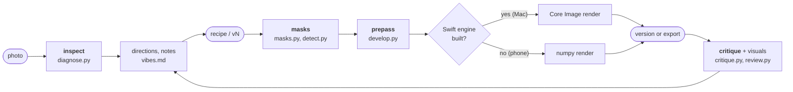

# Working on feedready

Issues and pull requests are welcome. For a bug, include the `doctor` report, the photo (or one like it), and what you asked for. Keep commits conventional and scoped (`feat(feedready): …`, `fix(feedready): …`), and run the self-test before pushing — it must end with `ALL PASSED`.

## The engine CLI

Claude runs these commands for you, but you can run them yourself to debug or script edits. Each one prints JSON.

```bash
cd feedready/skills/feedready
./run.sh doctor
./run.sh inspect photo.jpg
./run.sh masks recipe.json photo.jpg
./run.sh board photo.jpg a.json b.json c.json
./run.sh preview recipe.json photo.jpg --note "warmer"
./run.sh apply v3 photo.jpg -o out.jpg
```

| Command | What you get |
|---|---|
| `doctor` | the tier and anything missing |
| `inspect` | a coordinate grid, brightness stats, faces, scene classes, a `profile` (genre and hero), and `diagnostics.findings` (each problem with a ready-made recipe step) |
| `masks` | a contact sheet with every step's mask in red |
| `board` | the original next to each recipe or saved version, plus a `too_similar` warning for look-alike tiles |
| `preview` | a screen-size render saved as the next version (`v1`, `v2`…), with a compare, a diff against the last version, edit cards, an edit map, a review page and a measured `critique` |
| `apply` | the full-resolution photo and compare image, in `~/Pictures/feedready/` unless you pass `-o`. The recipe can be a saved version such as `v3`. |

A recipe is JSON, passed as a file or an inline string. This one crops for Instagram, brightens the eyes, adds bite to the snow caps and removes a reflective strip:

```json
{
  "preset": "instagram",
  "crop": {"aspect": "4:5", "focus": [0.545, 0.335], "focus_at": [0.5, 0.33]},
  "steps": [
    {"name": "lift eyes", "mask": {"type": "radial", "center": [0.555, 0.352], "radius": [0.07, 0.03]},
     "adjust": {"exposure": 0.4}},
    {"name": "snow caps", "mask": {"type": "object", "box": [0.0, 0.40, 1.0, 0.56],
      "points": [[0.72, 0.45], [0.12, 0.47]], "exclude": [[0.5, 0.45]]},
     "adjust": {"clarity": 30, "dehaze": 15}},
    {"name": "remove strip", "mask": {"type": "object", "box": [0.39, 0.80, 0.44, 0.835], "grow": 0.004},
     "adjust": {"heal": true}}
  ]
}
```

> [!IMPORTANT]
> Coordinates are fractions of the original photo, origin top-left, measured before the crop. Read them off the `inspect` grid, not by eye.

[`reference/recipe.md`](skills/feedready/reference/recipe.md) lists every slider, look, mask type, combinator and preset. [`reference/vibes.md`](skills/feedready/reference/vibes.md) is the photographer's playbook: which looks to offer for each genre, how notes map to moves, and the self-review checklist.

## How it fits together



All paths are under `skills/feedready/`:

| File | Owns |
|---|---|
| `scripts/feedready.py` | the CLI: working copy, saved versions, and the `inspect`, `board`, `preview` and `apply` flows |
| `scripts/render.py` | one render path for every command: looks resolved, prepass, crop, Core Image or numpy |
| `scripts/critique.py` | the self-review on each version: per-step impact, halos, skin, clipping, face vs background, HDR crunch, noise, and board similarity |
| `scripts/review.py` | everything you look at: grid, mask sheet, compare, edit cards, edit map, board, and the HTML review page |
| `scripts/diagnose.py` | the photo `profile` and the checks behind every finding (exposure, subject vs background, face vs background, face, skin-aware colour cast, haze, sky, bright distractions, headroom and crop). Add a check as one function in `CHECKS`. |
| `scripts/masks.py` | mask specs to masks, from simple shapes to EdgeTAM objects, plus combinators and edge refinement |
| `scripts/detect.py` | model access and per-photo caching. Every model path lives here. |
| `scripts/develop.py` | sliders and looks to engine ops, and the prepass: dehaze, clarity and texture via a guided filter, heal via MI-GAN |
| `swift/feedready_engine.swift` | decode, Vision masks and the Core Image render |

Per-photo working files, including every saved version, are cached in `~/.cache/feedready/work/<photo>-<hash>/`.

## Shipping a change

Claude Code runs an installed copy of the plugin, not this repo, so a change only reaches it through a version bump:

1. Edit and test in this repo.
2. Bump `version` in `.claude-plugin/plugin.json` and commit.
3. Update the installed copy:

   ```bash
   claude plugin marketplace update feedready && claude plugin update feedready@feedready
   ```

4. If you touched `swift/feedready_engine.swift`, rerun `setup.sh`. Until you do, `doctor` reports the engine as stale.
5. Run `/reload-plugins` in Claude Code.
6. Rebuild and re-upload the phone zip with `./build_zip.sh`.

## Tests

```bash
~/.cache/feedready/venv/bin/python tests/selftest.py
```

Run it from the repo root. It covers every slider's direction on both renderers, mask blending, crop geometry, the diagnostics, object masks and heal, and must end with `ALL PASSED`.

> [!TIP]
> Model checks print `skip` when that model isn't installed, so a pass with skips doesn't cover everything.

## README art

Everything in the README is drawn from one real session, the trek photo in `~/.cache/feedready/work/1-012c6c15/`, so these scripts only run on the Mac that holds it.

| File | Made by | Needs |
|---|---|---|
| `assets/hero.webp`, `assets/hero.gif` | `~/.cache/feedready/venv/bin/python assets/make_hero.py` | `ffmpeg`, `img2webp`, `rsvg-convert`, and the Geist and Instrument Serif fonts in `~/Library/Fonts` |
| `assets/sees.webp`, `assets/work.webp` | `~/.cache/feedready/venv/bin/python assets/make_panels.py` | the Geist fonts |
| `assets/art/talk.svg` | `uv run --no-project --with fonttools --with uharfbuzz python assets/make_talk.py` | the Geist fonts |
| `assets/art/mascot.svg` | hand-written | |

`make_hero.py` draws at 4× and writes a 1760 × 1040, 24 fps WebP (what GitHub shows), an 880 px, 12 fps GIF fallback, and an MP4 at `~/.cache/feedready/hero/hero.mp4`. Each scene's animation is stretched and then held so the text can be read; `SCENES` sets the base length, stretch and hold per scene. The WebP is lossy with a keyframe every 3 frames, which keeps it under 8 MB without leaving faint ghosts of earlier frames.

`make_panels.py` builds both panels at 2×. `sees.webp` rebuilds every region mask with `masks.build` from the v4 recipe and tints it on the photo, in the same colours `review.py` gives each step. `work.webp` redraws the top three v4 edit cards with type that stays readable at README width: the before/after crops come from `versions/v4-cards.jpg`, the names, reasons and slider values from `v4.json`, and the impact levels from the cards. If you change how `masks`, `cards` or the step colours work, rerun it, and rerun `make_hero.py` if `board` changes.

`make_talk.py` turns the chat cards' text into Geist outlines, so they render the same on every platform. The cards switch to a dark palette under `prefers-color-scheme: dark`.
