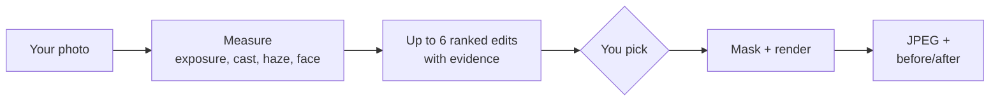
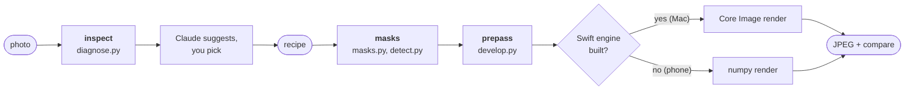
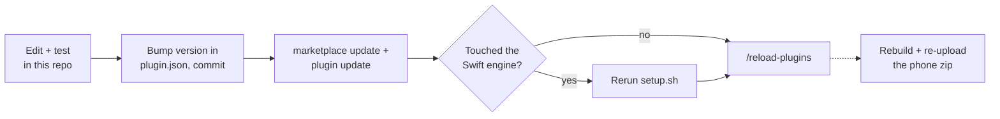

<p align="center">
  
</p>

<h1 align="center">feedready</h1>

<p align="center">
  <b>Hand Claude a phone photo. Get back one that's ready for Instagram or LinkedIn.</b>
</p>

<p align="center">
  
  
  
</p>

---

Claude doesn't eyeball your photo. It **measures it first**, then suggests up to six edits ranked by impact, each backed by a number like *"you're 2.9 stops darker than the sky"*. You pick. It applies them, down to just your face, the sky or one stray object.



**Nothing renders until you've picked.**

## Mac or phone

| | Mac | Phone |
|---|:---:|:---:|
| Crops (Instagram 4:5, LinkedIn square, story 9:16) | ✅ | ✅ |
| Lightroom-style global sliders | ✅ | ✅ |
| Shape, brightness and colour masks | ✅ | ✅ |
| Person, subject and face masks | ✅ | |
| Sky, mountain, water and tree masks | ✅ | |
| Masks for any object you box or click | ✅ | |
| Object removal | ✅ | |
| **Runs in** | Claude Code (desktop or terminal) | claude.ai app, as an uploaded skill |
| **Renders with** | Apple Core Image + Vision | numpy |

On the phone, ask for anything that needs a model and Claude tells you to do that edit on the Mac instead of faking it.

## Setup (Mac)

**You need:** an Apple Silicon Mac on macOS 14+, Xcode Command Line Tools (`xcode-select --install`), and `uv` or Python 3.14. Built and tested on macOS 26, M4.

**1. Install the plugin.** This repo is a Claude Code plugin and its own marketplace.

```bash
claude plugin marketplace add ~/sideones/feedready
```

```bash
claude plugin install feedready@feedready
```

**2. Build the runtime.** Safe to rerun.

```bash
~/sideones/feedready/skills/feedready/setup.sh --segformer --models
```

| What it sets up | Size | For |
|---|---:|---|
| Python 3.14 venv | ~90 MB download | everything |
| Swift engine | compiled locally | Core Image render, Vision masks |
| SegFormer-B0 (`--segformer`) | 4.4 MB | sky, mountain, water, tree masks |
| EdgeTAM (`--models`) | 41 MB | object masks |
| MI-GAN (`--models`) | 28 MB | object removal |

All of it lives in `~/.cache/feedready` (about **400 MB** total). You're done when the `doctor` report at the end says `"tier": "mac"` and `"missing": []`.

## Editing a photo

Attach a photo in any Claude Code session and ask. "make this insta ready" works, or call the skill by name:

```
/feedready:feedready suggest edits for my linkedin profile picture
```

Claude replies with a numbered list. Then:

| You reply | Claude does |
|---|---|
| `go` | applies all of them |
| `1, 3, 4` | applies just those |
| `2 but subtler` | adjusts that one, then applies |
| a pasted edit list + `apply` | skips suggesting, maps each item to an edit |

What comes back:

| | |
|---|---|
| **Where** | `~/Pictures/feedready/`, next to a `-compare.jpg` before/after |
| **Format** | sRGB JPEG, quality 100, full colour resolution |
| **Size** | full resolution, crops only. Over 30 MP? Claude asks whether to shrink first. |
| **Privacy** | metadata stripped, so **no GPS location** in your post |

## On your phone

1. Build the bundle on the Mac. It lands at `~/Desktop/feedready.zip` (pass a path to change that).

   ```bash
   ~/sideones/feedready/build_zip.sh
   ```

2. In claude.ai, upload it under **Settings → Capabilities → Skills**.
3. Attach a photo in any chat and ask for edits.

> [!NOTE]
> The phone bundle ships without models. **Rebuild and re-upload the zip whenever the skill changes.**

## Driving the engine yourself

Claude normally runs these. You can too, to debug or script edits. Every command prints JSON.

```bash
cd ~/sideones/feedready/skills/feedready
./run.sh doctor
./run.sh inspect photo.jpg
./run.sh masks recipe.json photo.jpg
./run.sh apply recipe.json photo.jpg -o out.jpg
```

| Command | What you get |
|---|---|
| `doctor` | the tier and anything missing |
| `inspect` | a coordinate grid, brightness stats, faces, scene classes, and `diagnostics.findings` (each problem with a ready-made recipe step) |
| `masks` | a contact sheet with every step's mask in red |
| `apply` | the rendered photo and compare image, in `~/Pictures/feedready/` unless you pass `-o` |

A recipe is JSON, as a file or an inline string. This one crops for Instagram, brightens the eyes, adds bite to the snow caps and removes a reflective strip:

```json
{
  "preset": "instagram",
  "crop": {"aspect": "4:5", "focus": [0.545, 0.335], "focus_at": [0.5, 0.33]},
  "steps": [
    {"name": "lift eyes", "mask": {"type": "radial", "center": [0.555, 0.352], "radius": [0.07, 0.03]},
     "adjust": {"exposure": 0.4}},
    {"name": "snow caps", "mask": {"type": "object", "box": [0.0, 0.40, 1.0, 0.56],
      "points": [[0.72, 0.45], [0.12, 0.47]], "exclude": [[0.5, 0.45]]},
     "adjust": {"clarity": 30, "dehaze": 15}},
    {"name": "remove strip", "mask": {"type": "object", "box": [0.39, 0.80, 0.44, 0.835], "grow": 0.004},
     "adjust": {"heal": true}}
  ]
}
```

> [!IMPORTANT]
> Coordinates are **fractions of the original photo, origin top-left**, before the crop. Read them off the `inspect` grid, not by eye.

Every slider, mask type, combinator and preset is in [`reference/recipe.md`](skills/feedready/reference/recipe.md).

## Under the hood



All paths are under `skills/feedready/`:

| File | Owns |
|---|---|
| `scripts/feedready.py` | the CLI and the pipeline: working copy, masks, prepass, render, compare |
| `scripts/diagnose.py` | the checks behind every suggestion (exposure, subject vs background, face, colour cast, haze, sky, bright distractions, headroom and crop). **Add a check as one function in `CHECKS`.** |
| `scripts/masks.py` | mask specs to masks, from simple shapes to EdgeTAM objects, plus combinators and edge refinement |
| `scripts/detect.py` | model access and per-photo caching. **Every model path lives here.** |
| `scripts/develop.py` | sliders to engine ops, and the prepass: dehaze, clarity and texture via a guided filter, heal via MI-GAN |
| `swift/feedready_engine.swift` | decode, Vision masks and the Core Image render |

Per-photo working files are cached in `~/.cache/feedready/work/<photo>-<hash>/`.

## Changing the skill

Claude Code runs an **installed copy**, not this repo. Changes only reach it through a version bump:



The update step:

```bash
claude plugin marketplace update feedready && claude plugin update feedready@feedready
```

To share it, push the repo to GitHub. Anyone can then install with this, and run `setup.sh` from the installed copy in `~/.claude/plugins/cache/feedready/`:

```bash
claude plugin marketplace add <github-user>/feedready && claude plugin install feedready@feedready
```

## Tests

```bash
cd ~/sideones/feedready
~/.cache/feedready/venv/bin/python tests/selftest.py
```

Covers every slider's direction on both renderers, mask blending, crop geometry, the diagnostics, object masks and heal. It must end with `ALL PASSED`.

> [!TIP]
> Model checks print `skip` when the model isn't installed. **A pass with skips isn't full coverage.**

## When things go wrong

| Problem | Fix |
|---|---|
| `doctor` says `engine` is missing or out of date | `xcode-select --install` if needed, then `skills/feedready/setup.sh` |
| `needs SegFormer` or `object masks need … EdgeTAM` | `skills/feedready/setup.sh --segformer --models` |
| A mask spills onto the wrong area | Check the `masks` contact sheet. Subtract `person` or `sky`, tighten the object box, or add `exclude` points. |
| `notes` calls an object mask low-confidence | The box is probably catching two things. Tighten it or add a point inside the object. |
| HEIC fails on the phone | Send a JPEG. The claude.ai sandbox may not read HEIC. |
| You want a clean slate for a photo | Delete its folder in `~/.cache/feedready/work/` |

## Model licences

| Model | Licence |
|---|---|
| EdgeTAM | Apache-2.0 |
| MI-GAN | MIT (training data is research-only) |
| SegFormer-B0 | NVIDIA source licence, **non-commercial** |

Fine for your own posts. Check them before using feedready commercially.
