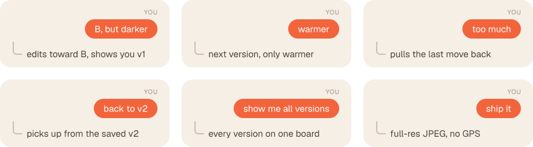

<p align="center">
  
</p>

<h1 align="center">feedready</h1>

<p align="center">
  <b>Hand Claude a phone photo. Get back one that's ready for the feed.</b>
</p>

<p align="center">
  
  
  
</p>

<p align="center">
  <picture>
    <source srcset="assets/hero.webp" type="image/webp">
    
  </picture>
</p>

Claude edits your photo like a photographer you hired. It measures what's off, shows you three rendered directions, then edits in versions and checks each one before you see it. You give notes in plain words until it's right.

## Talk to it like a photographer

<p align="center"></p>

Every version is saved, so nothing you liked is ever lost. Already know what you want? Paste an edit list and say `apply`.

## Every round shows its work

<table>
  <tr>
    <td width="60%"></td>
    <td width="40%" valign="top"></td>
  </tr>
</table>

Each edit is rendered on its own, zoomed to where it acts, and ranked by how much it changed the photo. The map shows where each one lands. On the Mac you also get a review page with a before/after slider across every version.

## Install

You need an Apple Silicon Mac on macOS 14+, the Xcode Command Line Tools and `uv` or Python 3.14.

```bash
git clone git@github.com:dataguyofprocol/feedready.git
claude plugin marketplace add ./feedready
claude plugin install feedready@feedready
./feedready/skills/feedready/setup.sh --segformer --models
```

Then attach a photo in any Claude Code session and say "make this insta ready". Finished photos land in `~/Pictures/feedready/`.

<details>
<summary><b>What setup installs</b> (about 400 MB, all in <code>~/.cache/feedready</code>)</summary>

| Piece | Size | Used for |
|---|---:|---|
| Python 3.14 venv | ~90 MB download | everything |
| Swift engine | compiled locally | Core Image render, Vision masks |
| SegFormer-B0 (`--segformer`) | 4.4 MB | sky, mountain, water and tree masks |
| EdgeTAM (`--models`) | 41 MB | object masks |
| MI-GAN (`--models`) | 28 MB | object removal |

Setup is safe to rerun. It ends with a `doctor` report; you're done when it says `"tier": "mac"` and `"missing": []`.

To install from GitHub without cloning, run `claude plugin marketplace add dataguyofprocol/feedready`, then run `setup.sh` from the installed copy under `~/.claude/plugins/cache/feedready/`.

</details>

<details>
<summary><b>What you get back</b></summary>

- A quality-100 JPEG at full resolution, next to a `-compare.jpg` before/after. Only the crop changes the size; over 30 MP, Claude asks whether to shrink first.
- Wide-gamut photos (most iPhone shots) stay in Display P3, so saturated colours aren't clipped to sRGB.
- All metadata is stripped, so your post carries no GPS location.

</details>

## On your phone

A lighter version runs as an uploaded skill in the claude.ai app. It renders with numpy and has no models, so a few edits stay on the Mac. Ask for one and Claude says so instead of faking it.

| | Mac | Phone |
|---|:---:|:---:|
| Crops, Lightroom-style sliders, looks | ✅ | ✅ |
| Shape, brightness and colour masks | ✅ | ✅ |
| Person, face, sky and scenery masks | ✅ | |
| Masks for any object, and object removal | ✅ | |

<details>
<summary><b>Set it up</b></summary>

1. On the Mac, run `./feedready/build_zip.sh`. The bundle lands at `~/Desktop/feedready.zip`.
2. In claude.ai, upload it under Settings → Capabilities → Skills.
3. Attach a photo in any chat and ask for edits.

The zip is a snapshot, so rebuild and re-upload it whenever the skill changes.

</details>

## More

<details>
<summary><b>Use it from Codex or another agent</b></summary>

`skills/feedready/` is a standard [Agent Skill](https://agentskills.io). Any agent that reads that format can run it, as long as it can look at images and run shell commands. Build the runtime once (see [Install](#install)), then link the skill into the agent's skills folder:

```bash
mkdir -p ~/.agents/skills && ln -s "$PWD/feedready/skills/feedready" ~/.agents/skills/feedready
```

Agents with their own folder, such as `.agent/skills/` in a project, get the same link there. Because it's a link, edits to your clone reach the agent without a version bump.

</details>

<details>
<summary><b>Troubleshooting</b></summary>

| Problem | Fix |
|---|---|
| `doctor` says `engine` is missing or out of date | `xcode-select --install` if needed, then rerun `skills/feedready/setup.sh` |
| `needs SegFormer` or `object masks need … EdgeTAM` | `skills/feedready/setup.sh --segformer --models` |
| A mask spills onto the wrong area | Check the `masks` contact sheet. Subtract `person` or `sky`, tighten the object box, or add `exclude` points. |
| `notes` calls an object mask low-confidence | The box is probably catching two things. Tighten it or add a point inside the object. |
| HEIC fails on the phone | Send a JPEG. The claude.ai sandbox may not read HEIC. |
| You want a clean slate for a photo | Delete its folder in `~/.cache/feedready/work/` |

</details>

<details>
<summary><b>Model licences</b></summary>

| Model | Licence |
|---|---|
| EdgeTAM | Apache-2.0 |
| MI-GAN | MIT (training data is research-only) |
| SegFormer-B0 | NVIDIA source licence, non-commercial |

That's fine for your own posts. Check them before using feedready commercially.

</details>

Want to drive the engine yourself, read the recipe format or change the skill? See [CONTRIBUTING.md](CONTRIBUTING.md).
