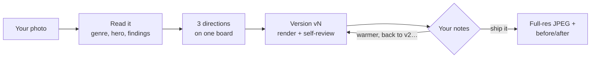
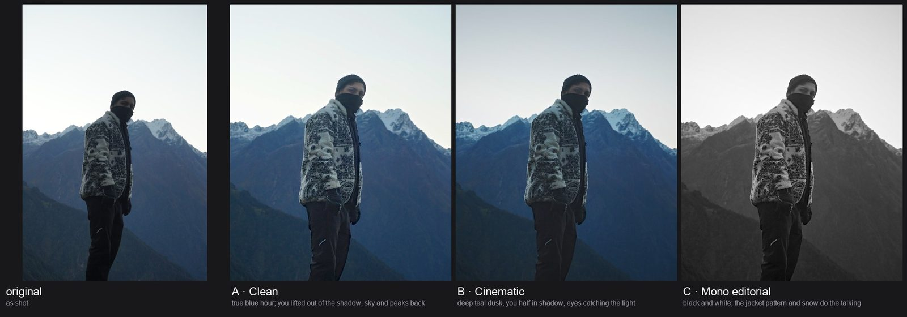
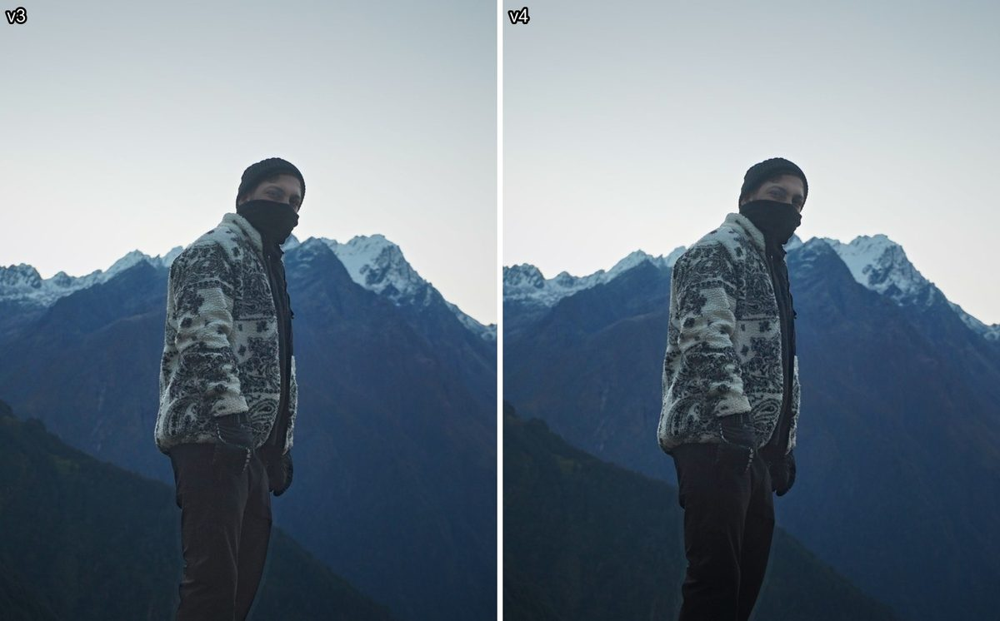
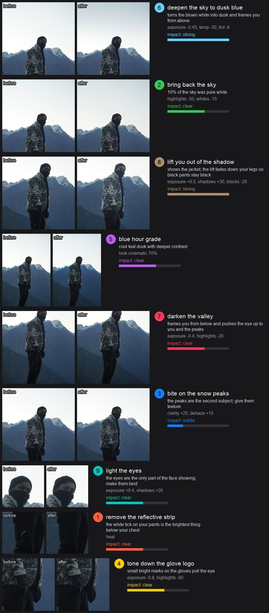
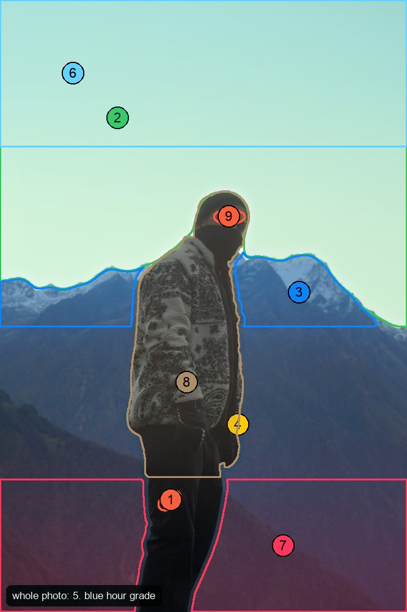
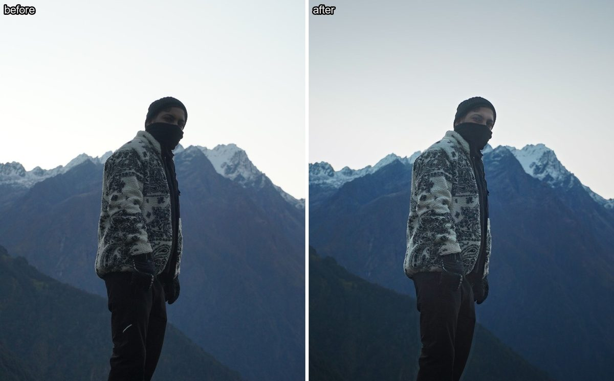
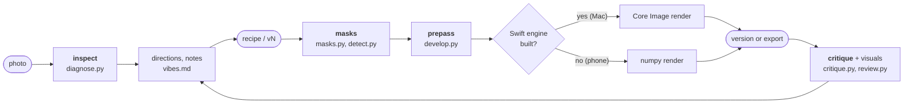
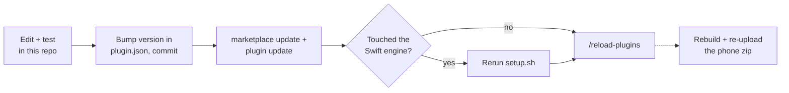

<p align="center">
  
</p>

<h1 align="center">feedready</h1>

<p align="center">
  <b>Hand Claude a phone photo. Get back one that's ready for Instagram or LinkedIn.</b>
</p>

<p align="center">
  
  
  
</p>

---

Claude works like the Lightroom photographer you hired:

1. **It reads the photo.** It measures the genre, where the eye should land, and what's holding the photo back, with numbers like *"the wall is 1.0 stop brighter than your face"*.
2. **It shows you directions.** You get three rendered looks side by side: a clean version, plus two that differ visibly.
3. **It edits in rounds.** Each version is rendered and checked against a measured critique (halos, orange skin, blown highlights, steps that do nothing) before you see it.
4. **It takes your notes.** You reply in plain words ("darker background", "back to v2"), and it keeps going until you or it is satisfied.



**Every version is saved**, so "back to v2" or "v2 but warmer" just works.

## See it work

This is one real session, start to finish, on a blue-hour trek photo headed for Instagram.

**1. Claude reads the photo.** `inspect` measures it before anything is suggested:

| Finding | What it means for the edit |
|---|---|
| Person in scene, outdoors | it's a travel portrait, not a landscape |
| You're 3.9 stops darker than the sky | the jacket pattern is lost in shadow |
| 10.5% of the sky is pure white | the top of the frame reads as blank paper |
| 31% of the frame is empty above you | crop to 4:5 and trim the sky |
| A bright logo on the glove | a small spot pulling the eye away from you |
| Face covered, not readable as skin | face checks are skipped; Claude places the eye light from a zoomed grid |

**2. Three directions, rendered.** All three share the same base fixes: the 4:5 crop, the sky recovered, texture on the snow peaks, the eyes lit, and the reflective bits tamed. Each then adds its own look. `board` checks that no two directions look alike.

<p align="center"></p>

> **You:** what do you suggest? C is out
>
> **Claude:** B's dusk mood with A's lift on you. The blue, the snow and your black-and-white jacket carry this photo. A leaves the sky flat; B buries you in shadow.

**3. A version, self-reviewed before you see it.** v3 lifted the whole body, and Claude's own review caught that the black pants went muddy brown. v4 fades the lift down the legs and holds the blacks. You only ever see v4.

<p align="center"></p>

**4. What each edit did, and where.** Each step is rendered on its own, zoomed to where it acts, and ranked by how much it actually changed the photo. The map numbers where every step lands.

<table>
  <tr>
    <td width="60%"></td>
    <td width="40%" valign="top"></td>
  </tr>
</table>

On the Mac you also get `review.html`: drag a before/after split, click between v1…v4, and hold <kbd>B</kbd> to see the original.

**5. Ship it.** `apply v4` renders the final at full resolution for the 4:5 crop (1333 × 1666), with no metadata.

<p align="center"></p>

## Mac or phone

| | Mac | Phone |
|---|:---:|:---:|
| Crops (Instagram 4:5, LinkedIn square, story 9:16) | ✅ | ✅ |
| Lightroom-style global sliders | ✅ | ✅ |
| Shape, brightness and colour masks | ✅ | ✅ |
| Person, subject and face masks | ✅ | |
| Sky, mountain, water and tree masks | ✅ | |
| Masks for any object you box or click | ✅ | |
| Object removal | ✅ | |
| **Runs in** | Claude Code (desktop or terminal) | claude.ai app, as an uploaded skill |
| **Renders with** | Apple Core Image + Vision | numpy |

On the phone, ask for anything that needs a model and Claude tells you to do that edit on the Mac instead of faking it.

## Setup (Mac)

**You need:** an Apple Silicon Mac on macOS 14+, Xcode Command Line Tools (`xcode-select --install`), and `uv` or Python 3.14. Built and tested on macOS 26, M4.

**1. Install the plugin.** This repo is a Claude Code plugin and its own marketplace.

```bash
claude plugin marketplace add ~/sideones/feedready
```

```bash
claude plugin install feedready@feedready
```

**2. Build the runtime.** Safe to rerun.

```bash
~/sideones/feedready/skills/feedready/setup.sh --segformer --models
```

| What it sets up | Size | For |
|---|---:|---|
| Python 3.14 venv | ~90 MB download | everything |
| Swift engine | compiled locally | Core Image render, Vision masks |
| SegFormer-B0 (`--segformer`) | 4.4 MB | sky, mountain, water, tree masks |
| EdgeTAM (`--models`) | 41 MB | object masks |
| MI-GAN (`--models`) | 28 MB | object removal |

All of it lives in `~/.cache/feedready` (about **400 MB** total). You're done when the `doctor` report at the end says `"tier": "mac"` and `"missing": []`.

## Editing a photo

Attach a photo in any Claude Code session and ask. "make this insta ready" works, or call the skill by name:

```
/feedready:feedready suggest edits for my linkedin profile picture
```

Claude replies with a board of three directions, unless you already said the vibe. Then:

| You reply | Claude does |
|---|---|
| `B` or `B but darker` | edits toward that direction and shows you v1 |
| `warmer`, `too much`, `make me pop` | the next version, changing only what you asked about |
| `back to v2`, `v2 but warmer` | starts from that saved version |
| `show me all versions` | a board of every version side by side |
| `ship it` | exports that version at full resolution |
| a pasted edit list + `apply` | skips the directions and maps each item to an edit |

Each round shows you:
- A before/after image.
- Cards: each edit alone, zoomed to where it acts, ranked by how much it changes.
- A map of where every edit lands.
- On the Mac, a review page with a before/after slider across all versions.

What comes back:

| | |
|---|---|
| **Where** | `~/Pictures/feedready/`, next to a `-compare.jpg` before/after |
| **Format** | JPEG, quality 100, full colour resolution |
| **Colour** | Display P3 for wide-gamut photos (most iPhone shots), so saturated colours aren't clipped to sRGB; sRGB otherwise |
| **Size** | full resolution, crops only. Over 30 MP? Claude asks whether to shrink first. |
| **Privacy** | metadata stripped, so **no GPS location** in your post |

## On your phone

1. Build the bundle on the Mac. It lands at `~/Desktop/feedready.zip` (pass a path to change that).

   ```bash
   ~/sideones/feedready/build_zip.sh
   ```

2. In claude.ai, upload it under **Settings → Capabilities → Skills**.
3. Attach a photo in any chat and ask for edits.

> [!NOTE]
> The phone bundle ships without models. **Rebuild and re-upload the zip whenever the skill changes.**

## Other agents

`skills/feedready/` is a standard [Agent Skill](https://agentskills.io): a `SKILL.md` with `name` and `description`, plus its scripts and references. Any agent that reads that format can run it, provided it can look at images and run shell commands.

1. Build the runtime once (step 2 of [Setup](#setup-mac)).
2. Link the skill into the agent's skills folder. For Codex, and other agents that read `~/.agents/skills`:

   ```bash
   mkdir -p ~/.agents/skills && ln -s ~/sideones/feedready/skills/feedready ~/.agents/skills/feedready
   ```

   Other agents use their own folder, such as `.agent/skills/` in a project. Link the same directory there.

The link points at this repo, so edits reach the agent with no version bump. The agent shows you files with whatever file-sending tool it has; without one, it gives you their paths.

## Driving the engine yourself

Claude normally runs these. You can too, to debug or script edits. Every command prints JSON.

```bash
cd ~/sideones/feedready/skills/feedready
./run.sh doctor
./run.sh inspect photo.jpg
./run.sh masks recipe.json photo.jpg
./run.sh board photo.jpg a.json b.json c.json
./run.sh preview recipe.json photo.jpg --note "warmer"
./run.sh apply v3 photo.jpg -o out.jpg
```

| Command | What you get |
|---|---|
| `doctor` | the tier and anything missing |
| `inspect` | a coordinate grid, brightness stats, faces, scene classes, a `profile` (genre and hero), and `diagnostics.findings` (each problem with a ready-made recipe step) |
| `masks` | a contact sheet with every step's mask in red |
| `board` | the original next to each recipe or saved version, plus a `too_similar` warning for look-alike tiles |
| `preview` | a screen-size render saved as the next version (`v1`, `v2`…), with a compare, a diff against the last version, edit cards, an edit map, a review page and a measured `critique` |
| `apply` | the full-resolution photo and compare image, in `~/Pictures/feedready/` unless you pass `-o`. The recipe can be a saved version such as `v3`. |

A recipe is JSON, as a file or an inline string. This one crops for Instagram, brightens the eyes, adds bite to the snow caps and removes a reflective strip:

```json
{
  "preset": "instagram",
  "crop": {"aspect": "4:5", "focus": [0.545, 0.335], "focus_at": [0.5, 0.33]},
  "steps": [
    {"name": "lift eyes", "mask": {"type": "radial", "center": [0.555, 0.352], "radius": [0.07, 0.03]},
     "adjust": {"exposure": 0.4}},
    {"name": "snow caps", "mask": {"type": "object", "box": [0.0, 0.40, 1.0, 0.56],
      "points": [[0.72, 0.45], [0.12, 0.47]], "exclude": [[0.5, 0.45]]},
     "adjust": {"clarity": 30, "dehaze": 15}},
    {"name": "remove strip", "mask": {"type": "object", "box": [0.39, 0.80, 0.44, 0.835], "grow": 0.004},
     "adjust": {"heal": true}}
  ]
}
```

> [!IMPORTANT]
> Coordinates are **fractions of the original photo, origin top-left**, before the crop. Read them off the `inspect` grid, not by eye.

Every slider, look, mask type, combinator and preset is in [`reference/recipe.md`](skills/feedready/reference/recipe.md). The photographer's playbook (which looks to offer per genre, how notes map to moves, and the self-review checklist) is in [`reference/vibes.md`](skills/feedready/reference/vibes.md).

## Under the hood



All paths are under `skills/feedready/`:

| File | Owns |
|---|---|
| `scripts/feedready.py` | the CLI: working copy, saved versions, and the `inspect`, `board`, `preview` and `apply` flows |
| `scripts/render.py` | one render path for every command: looks resolved, prepass, crop, Core Image or numpy |
| `scripts/critique.py` | the self-review on each version: per-step impact, halos, skin, clipping, face vs background, HDR crunch, noise, and board similarity |
| `scripts/review.py` | everything you look at: grid, mask sheet, compare, edit cards, edit map, board, and the HTML review page |
| `scripts/diagnose.py` | the photo `profile` and the checks behind every finding (exposure, subject vs background, face vs background, face, skin-aware colour cast, haze, sky, bright distractions, headroom and crop). **Add a check as one function in `CHECKS`.** |
| `scripts/masks.py` | mask specs to masks, from simple shapes to EdgeTAM objects, plus combinators and edge refinement |
| `scripts/detect.py` | model access and per-photo caching. **Every model path lives here.** |
| `scripts/develop.py` | sliders and looks to engine ops, and the prepass: dehaze, clarity and texture via a guided filter, heal via MI-GAN |
| `swift/feedready_engine.swift` | decode, Vision masks and the Core Image render |

Per-photo working files, including every saved version, are cached in `~/.cache/feedready/work/<photo>-<hash>/`.

## Changing the skill

Claude Code runs an **installed copy**, not this repo. Changes only reach it through a version bump:



The update step:

```bash
claude plugin marketplace update feedready && claude plugin update feedready@feedready
```

To share it, push the repo to GitHub. Anyone can then install with this, and run `setup.sh` from the installed copy in `~/.claude/plugins/cache/feedready/`:

```bash
claude plugin marketplace add <github-user>/feedready && claude plugin install feedready@feedready
```

## Tests

```bash
cd ~/sideones/feedready
~/.cache/feedready/venv/bin/python tests/selftest.py
```

Covers every slider's direction on both renderers, mask blending, crop geometry, the diagnostics, object masks and heal. It must end with `ALL PASSED`.

> [!TIP]
> Model checks print `skip` when the model isn't installed. **A pass with skips isn't full coverage.**

## When things go wrong

| Problem | Fix |
|---|---|
| `doctor` says `engine` is missing or out of date | `xcode-select --install` if needed, then `skills/feedready/setup.sh` |
| `needs SegFormer` or `object masks need … EdgeTAM` | `skills/feedready/setup.sh --segformer --models` |
| A mask spills onto the wrong area | Check the `masks` contact sheet. Subtract `person` or `sky`, tighten the object box, or add `exclude` points. |
| `notes` calls an object mask low-confidence | The box is probably catching two things. Tighten it or add a point inside the object. |
| HEIC fails on the phone | Send a JPEG. The claude.ai sandbox may not read HEIC. |
| You want a clean slate for a photo | Delete its folder in `~/.cache/feedready/work/` |

## Model licences

| Model | Licence |
|---|---|
| EdgeTAM | Apache-2.0 |
| MI-GAN | MIT (training data is research-only) |
| SegFormer-B0 | NVIDIA source licence, **non-commercial** |

Fine for your own posts. Check them before using feedready commercially.
